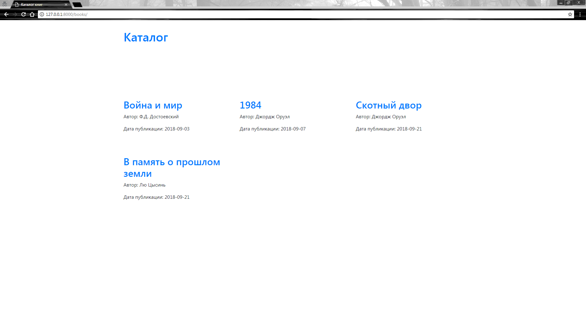
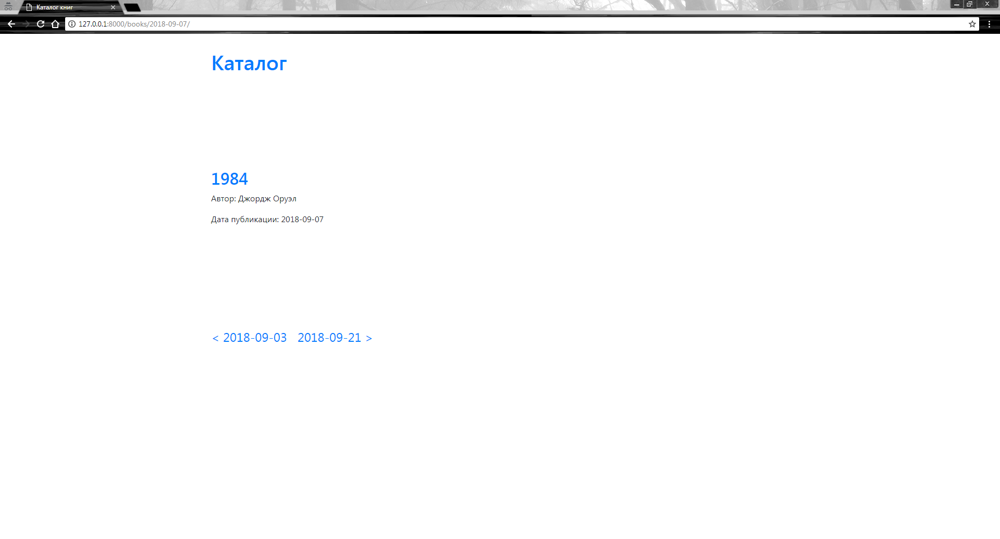

# Материалы для домашних работ по курсу «Django»

## Блок 1. Обработка запросов. Работа с шаблонами

1.1. [Знакомство с Django. Подготовка и запуск проекта](./1.1-first-project);

1.2. [Обработка запросов и шаблоны](./1.2-requests-templates).

## Блок 2. Базы данных

2.1. [Базы данных](./2.1-databases),

2.2. [Базы данных 2](./2.2-databases-2).

## Блок 3. Взаимодействие с сайтом

3.1. [Знакомство с API на примере Django REST framework](./3.1-drf-intro),

3.2. [CRUD в DRF](./3.2-crud),

3.3. [Разделение доступа в DRF](./3.3-permissions),

3.4. [Тестирование Django-приложений с использованием Pytest](./3.4-django-testing).

## Требования

- браузер;
- редактор кода или IDE, например, Pycharm;
- система контроля версий git, установленная локально;
- аккаунт на GitHub;

## Как работать с репозиторием

Описано [здесь](./HOW_TO_WORK.md).

---

# Делаем онлайн-библиотеку

## Задание

Необходимо сделать онлайн-библиотеку с каталогом книг. Библиотека должна состоять из двух страниц:

- `/books/` —- отображение списка книг;
- `/books/2021-01-02/` — отображение списка книг за дату 2021-01-02 (год, месяц, день).

Книга имеет три параметра:

- Название,
- Автор,
- Дата публикации (pub_date).

Также на странице `/books/<pub_date>/` сделать возможность пагинации на страницу с книгами предыдущей даты и следующей даты.

Например, в библиотеке имеется 4 книги: одна за пятое число условного месяца, вторая за третье число того же месяца, третья за десятое и последняя за одиннадцатое. На странице `/books/` отображаем все эти книги. А на странице `/books/2021-05-05/` отображаем первую книгу, и ссылки на страницу с книгами за предыдущую дату (2021-05-03) и следующую дату (2021-05-10).

## Ожидаемый результат





## Документация по проекту

Для запуска проекта необходимо

Установить зависимости:

```bash
pip install -r requirements.txt
```

Выполнить следующие команды:

- Команда для создания миграций приложения для базы данных

```bash
python manage.py migrate
```

- Команда для запуска приложения

```bash
python manage.py runserver
```

- Для загрузки начальных данных модели Book необходимо выполнить команду:

```bash
python manage.py loaddata fixtures/books.json
```
